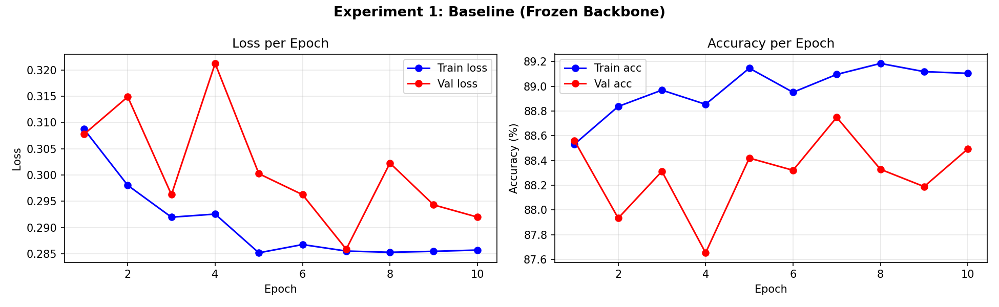
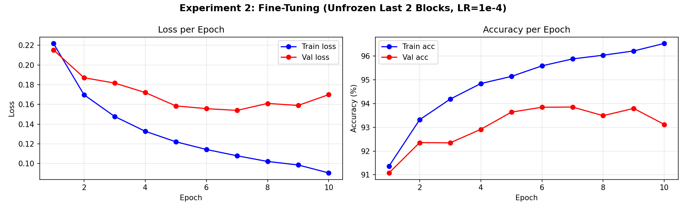
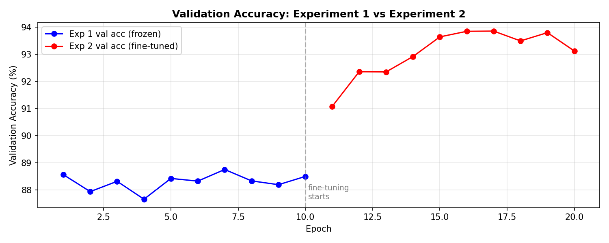
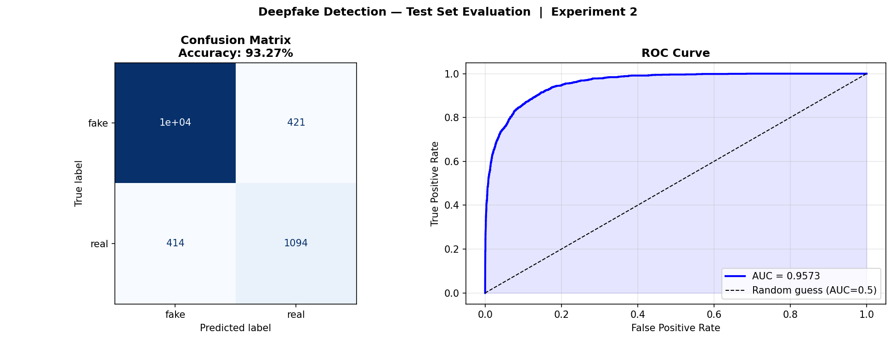
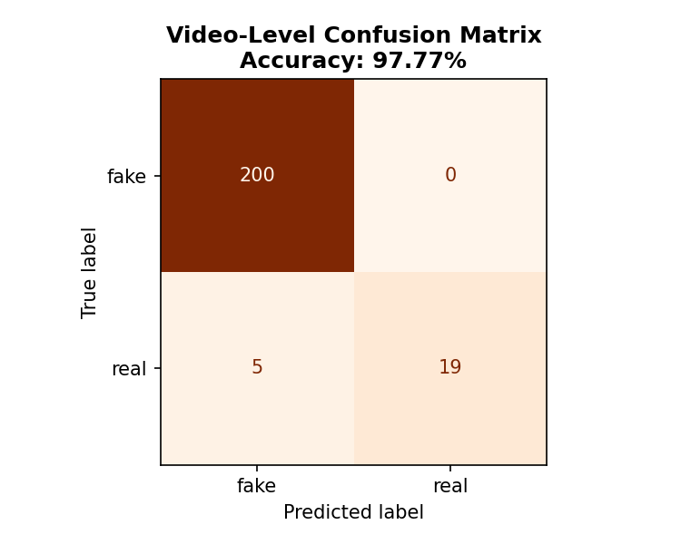
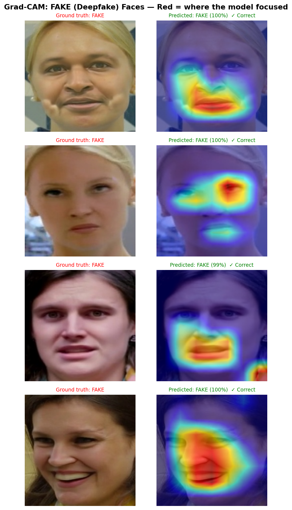

# Deepfake Detection with EfficientNet-B0

A deep learning pipeline that detects AI-generated (deepfake) face videos using
transfer learning on EfficientNet-B0. Built as a group final project for
**DATA 621 — Big Data Analytics** at UMBC.

---

## Results

| Metric | Value |
|---|---|
| Frame-level Accuracy | **93.27%** |
| Video-level Accuracy | **97.77%** |
| AUC (ROC) | **0.9573** |
| Test set size | 12,410 frames / 224 videos |

### Training Curves

| Experiment 1 (Frozen Backbone) | Experiment 2 (Fine-Tuned) |
|---|---|
|  |  |

### Experiment Comparison & Final Evaluation

| Experiment Comparison | Test Set (Confusion Matrix + ROC) |
|---|---|
|  |  |

### Video-Level Evaluation & Grad-CAM

| Video-Level Confusion Matrix | Grad-CAM — Fake Faces |
|---|---|
|  |  |

> **Grad-CAM** shows which facial regions the model focuses on. Red/warm areas = high attention.
> The model consistently highlights eye edges, hairlines, and mouth boundaries —
> exactly where GAN artifacts tend to appear.

---

## Pipeline Overview

```
Raw MP4 Videos (DFD Dataset — Kaggle)
        │
        ▼  src/data_pipeline_optimized.ipynb
Step 1: Extract frames  (1 FPS, max 30 per video)
        │
        ▼
Step 2: Detect & crop faces  (MTCNN, 224×224 px)
        │
        ▼
Step 3: Split by video — train 70% / val 15% / test 15%
        │  (video-level split prevents data leakage)
        ▼
82,052 face images
  train: 57,501  |  val: 12,141  |  test: 12,410

        │
        ▼  src/model_training_evaluation.ipynb
Step 4: Train EfficientNet-B0 with transfer learning
        │
        ├── Experiment 1: Frozen backbone, LR=1e-3   → val acc 88.75%
        └── Experiment 2: Fine-tune last 2 blocks, LR=1e-4 → val acc 93.86% ✓
        │
        ▼
Step 5: Evaluate on test set
        Frame accuracy 93.27%  |  Video accuracy 97.77%  |  AUC 0.9573
        │
        ▼
Step 6: Grad-CAM visualisation
```

---

## Model Architecture

**EfficientNet-B0** pretrained on ImageNet, adapted for binary classification:

```
[EfficientNet-B0 Backbone — pretrained on ImageNet]
  features[0]  : Conv2d 3 → 32  (stem)
  features[1–8]: MBConv blocks  (mobile inverted bottleneck)
  features[8]  : Conv2d 320 → 1280  (final expansion)
  AdaptiveAvgPool2d → (1280,)

[Classifier Head — trained from scratch]
  Dropout(p=0.3)
  Linear(1280 → 2)   ← outputs: [FAKE, REAL]
```

**Why EfficientNet-B0?**
- 5.3M parameters — 5× fewer than ResNet-50
- Compound scaling (depth + width + resolution balanced together)
- Better accuracy per FLOP than ResNet; ideal for rapid experimentation

**Transfer Learning Strategy:**

| | Experiment 1 (Baseline) | Experiment 2 (Fine-tuning) |
|---|---|---|
| Backbone | Frozen | Last 2 blocks unfrozen |
| Trainable params | 2,562 | 1,131,954 |
| Learning rate | 1e-3 | 1e-4 |
| Best val accuracy | 88.75% | **93.86%** |

---

## Dataset

**DFD (Deep Fake Detection) — Original Dataset**
Source: [Kaggle — sanikatiwarekar/deep-fake-detection-dfd-entire-original-dataset](https://www.kaggle.com/datasets/sanikatiwarekar/deep-fake-detection-dfd-entire-original-dataset)

| | Original (Real) | Manipulated (Fake) |
|---|---|---|
| Videos | 363 | 3,068 |
| Avg duration | 39.3 s | 30.1 s |
| Resolution | 1920×1080 | 1920×1080 |
| Face images (after processing) | 10,128 | 71,924 |

> The dataset is **not included** in this repository (~22 GB).
> See [How to Run](#how-to-run) for setup instructions.

---

## Repository Structure

```
DeepFakeDetection/
│
├── src/                                      # Source code (Jupyter notebooks)
│   ├── data_pipeline_optimized.ipynb         # Steps 1–3: video → faces → splits
│   └── model_training_evaluation.ipynb       # Steps 4–6: train, evaluate, Grad-CAM
│
├── models/                                   # Trained model weights
│   ├── best_model.pth                        # Final best model (Experiment 2)
│   ├── exp1_best_model.pth                   # Experiment 1 best weights
│   └── exp2_best_model.pth                   # Experiment 2 best weights
│
├── results/                                  # Training metrics and evaluation charts
│   ├── model_results.json                    # All metrics and training history
│   ├── exp1_training_curves.png
│   ├── exp2_training_curves.png
│   ├── experiment_comparison.png
│   ├── test_evaluation.png                   # Confusion matrix + ROC curve
│   ├── video_level_evaluation.png
│   ├── gradcam_fake.png
│   └── gradcam_real.png
│
├── configs/                                  # Configuration files
│   └── dataset_config.json                   # Dataset paths and split sizes
│
├── docs/                                     # Documentation assets
│   ├── dataset_overview.png
│   ├── sample_real_faces.png
│   ├── sample_fake_faces.png
│   ├── sample_training_batch.png
│   └── DeepFake Detection Presentation.pptx  # Final project presentation
│
├── .github/                                  # GitHub configuration
│   └── ISSUE_TEMPLATE/
│       ├── bug_report.md
│       └── feature_request.md
│
├── README.md
├── requirements.txt
├── .gitignore
├── LICENSE
├── CONTRIBUTING.md
└── CHANGELOG.md
```

---

## How to Run

### Prerequisites

1. A **Google Colab** account (free tier works; GPU recommended)
2. A **Kaggle** account with API token (`kaggle.json`)
3. ~30 GB free space on **Google Drive**

### Step 1 — Data Pipeline (run once)

Open `src/data_pipeline_optimized.ipynb` in Google Colab.

```
Runtime → Change runtime type → GPU (T4 or better)
```

The notebook will:
1. Install dependencies (including Pillow fix for Colab)
2. Mount your Google Drive
3. Download the DFD dataset from Kaggle (~22 GB)
4. Extract frames, detect & crop faces with MTCNN
5. Split the data into `train / val / test` folders
6. Save `configs/dataset_config.json`

### Step 2 — Training & Evaluation

Open `src/model_training_evaluation.ipynb` in Google Colab.

Make sure `configs/dataset_config.json` and the `04_dataset/` folder are accessible
(either locally or via Google Drive). The notebook will:

1. Rebuild DataLoaders from `dataset_config.json`
2. Run Experiment 1 — frozen backbone (~15 min on T4 GPU)
3. Run Experiment 2 — fine-tuning (~20 min on T4 GPU)
4. Evaluate the best model and produce all charts
5. Save model weights to `models/` and metrics to `results/`

### Running Locally (Windows / Linux)

```bash
# Clone the repo
git clone https://github.com/lulumehippo/DeepFakeDetection.git
cd DeepFakeDetection

# Install dependencies
pip install -r requirements.txt
pip install --upgrade --force-reinstall Pillow   # fixes PIL._util on some systems

# Open notebooks
jupyter notebook src/
```

> You will still need the `04_dataset/` folder. Either run the data pipeline first
> or copy it from Google Drive.

---

## Key Hyperparameters

| Parameter | Value |
|---|---|
| Optimizer | Adam |
| Loss function | CrossEntropyLoss |
| Experiment 1 LR | 1e-3 |
| Experiment 2 LR | 1e-4 |
| LR scheduler | ReduceLROnPlateau (factor=0.5, patience=2) |
| Dropout | 0.3 |
| Weight decay | 1e-4 |
| Epochs per experiment | 10 |
| Batch size | 32 |
| Image size | 224×224 |
| Data augmentation | Random H-flip, ColorJitter, RandomRotation ±10° |

---

## Tech Stack

| Library | Purpose |
|---|---|
| PyTorch + torchvision | Model training & DataLoaders |
| facenet-pytorch (MTCNN) | Face detection & cropping |
| OpenCV | Video frame extraction |
| scikit-learn | Metrics (accuracy, AUC, confusion matrix) |
| grad-cam | Gradient-weighted Class Activation Mapping |
| Pillow | Image I/O |
| tqdm | Progress bars |
| Kaggle API | Dataset download |

---

## Contributing

See [CONTRIBUTING.md](CONTRIBUTING.md) for how to report bugs, request features,
or submit pull requests.

## Changelog

See [CHANGELOG.md](CHANGELOG.md) for version history.

## License

This project is licensed under the [MIT License](LICENSE).

The DFD dataset is subject to its own
[Kaggle dataset license (MIT)](https://www.kaggle.com/datasets/sanikatiwarekar/deep-fake-detection-dfd-entire-original-dataset).
